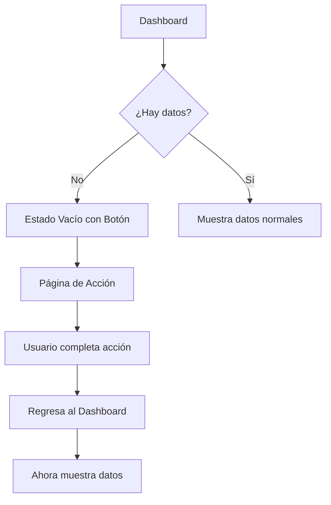

# 🎯 Dashboard - Estados Vacíos Mejorados

## 📋 Resumen de Cambios

He agregado botones de acción inteligentes en todos los cuadros vacíos del dashboard para mejorar la experiencia del usuario y guiarlo hacia las acciones correctas.

## 🔗 Botones Agregados por Sección

### **1. Puntuación Diaria (Daily Score)**
```tsx
// Cuando no hay datos de puntuación
<Link href="/dashboard/habits">
  <Plus className="w-5 h-5" />
  Ver mis hábitos
  <ArrowRight className="w-4 h-4" />
</Link>
```
- **Acción**: Lleva a la página de hábitos
- **Color**: Rojo (`bg-red-600`)
- **Mensaje**: "Completa algunos hábitos para ver tu puntuación diaria"

### **2. Progreso Semanal (Progress Chart)**
```tsx
// Cuando no hay datos de progreso
<Link href="/dashboard/habits">
  <Clock className="w-5 h-5" />
  Registrar hábito
  <ArrowRight className="w-4 h-4" />
</Link>
```
- **Acción**: Lleva a la página de hábitos para registrar
- **Color**: Azul (`bg-blue-600`)
- **Mensaje**: "Comienza a registrar tus hábitos para ver tu progreso"

### **3. Rachas Activas (Active Streaks)**
```tsx
// Cuando no hay rachas
<Link href="/dashboard/habits">
  <Zap className="w-5 h-5" />
  Crear hábito
  <ArrowRight className="w-4 h-4" />
</Link>
```
- **Acción**: Lleva a crear un nuevo hábito
- **Color**: Naranja (`bg-orange-600`)
- **Mensaje**: "Comienza un hábito para ver tu racha"

### **4. Desafíos Activos (Active Challenges)**
```tsx
// Cuando no hay desafíos
<Link href="/dashboard/challenges">
  <Trophy className="w-5 h-5" />
  Ver desafíos
  <ArrowRight className="w-4 h-4" />
</Link>
```
- **Acción**: Lleva a la página de desafíos
- **Color**: Púrpura (`bg-purple-600`)
- **Mensaje**: "Comienza un desafío para acelerar tu progreso"

### **5. Acciones Rápidas (Quick Actions)**
```tsx
// Todos los botones ahora son Links funcionales
<Link href="/dashboard/habits">Log Rápido</Link>
<Link href="/dashboard/habits">Nuevo Hábito</Link>
<Link href="/dashboard/challenges">Ver Desafíos</Link>
<Link href="/dashboard/progress">Estadísticas</Link>
```

## 🎨 Diseño de los Botones

### **Estilo Consistente**
```css
/* Todos los botones siguen el mismo patrón */
inline-flex items-center gap-2 
px-6 py-3 
font-semibold rounded-lg 
transition-colors duration-200
```

### **Colores por Categoría**
- **Hábitos**: Rojo/Naranja (`bg-red-600`, `bg-orange-600`)
- **Progreso**: Azul (`bg-blue-600`)
- **Desafíos**: Púrpura (`bg-purple-600`)

### **Iconografía**
- **Plus**: Crear/Agregar contenido
- **Clock**: Registrar/Log de actividades
- **Zap**: Acción rápida/Energía
- **Trophy**: Desafíos/Logros
- **ArrowRight**: Navegación/Siguiente paso

## 📱 Experiencia del Usuario

### **Antes**
- Cuadros vacíos con solo texto informativo
- Usuario no sabía qué hacer
- Falta de guía clara

### **Ahora**
- Botones claros con acciones específicas
- Navegación directa a las páginas correctas
- Mensajes motivacionales
- Colores que indican el tipo de acción

## 🚀 Beneficios Implementados

### **1. Guía del Usuario**
- **Clear CTAs**: Botones claros que indican qué hacer
- **Progressive Disclosure**: Información gradual según el progreso
- **Action-Oriented**: Siempre hay una acción clara disponible

### **2. Navegación Intuitiva**
- **Logical Flow**: Botones llevan a páginas lógicamente relacionadas
- **Consistent Patterns**: Mismo estilo en todos los estados vacíos
- **Visual Hierarchy**: Colores y tamaños que guían la atención

### **3. Engagement**
- **Motivational Copy**: Mensajes que motivan a la acción
- **Visual Feedback**: Iconos que refuerzan el mensaje
- **Immediate Action**: Un click lleva directamente a la acción

## 🔄 Flujo de Navegación



## 📊 Estados Manejados

### **1. Usuario Nuevo (Sin Datos)**
- Todos los cuadros muestran botones de acción
- Guía paso a paso para comenzar
- Motivación para completar el onboarding

### **2. Usuario Parcial (Algunos Datos)**
- Solo los cuadros vacíos muestran botones
- Enfoque en completar áreas faltantes
- Progreso visible en áreas completadas

### **3. Usuario Activo (Con Datos)**
- Todos los cuadros muestran datos reales
- Botones de Quick Actions siempre disponibles
- Navegación rápida a funciones avanzadas

## ✨ Resultado Final

El dashboard ahora es una **experiencia guiada** que:
- ✅ Nunca deja al usuario sin saber qué hacer
- ✅ Proporciona acciones claras en cada estado vacío
- ✅ Mantiene consistencia visual y de navegación
- ✅ Motiva al usuario a completar su perfil
- ✅ Facilita el descubrimiento de funcionalidades

Cada estado vacío es ahora una **oportunidad de engagement** en lugar de un callejón sin salida.
