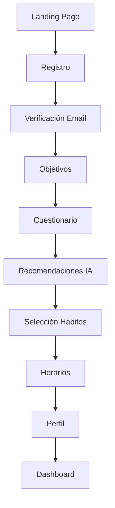

# 🚀 Sistema de Onboarding Completo - Gainz Factory

## 📋 Resumen del Sistema

Hemos creado un sistema de onboarding completo e inteligente que integra perfectamente con el schema de Prisma existente y la autenticación actual. El sistema es modular, escalable y está diseñado para proporcionar una experiencia de usuario excepcional.

## 🗄️ Schema de Base de Datos Actualizado

### Nuevos Campos en el Modelo User
```prisma
model User {
  // Onboarding & Profile Data
  onboardingCompleted   Boolean   @default(false)
  onboardingStep        String?   @default("welcome")
  timezone              String?   @default("America/Lima")
  notificationPreferences Json?   @default("[]")
  personalManifesto     String?
  
  // User Preferences
  preferredLanguage     String?   @default("es")
  fitnessLevel          String?   // beginner, intermediate, advanced
  primaryGoals          String[]  @default([])
  weeklyCommitment      Int?      @default(3) // days per week
  intensityPreference   String?   // quick, intense, balanced
  motivationType        String?   // health, appearance, energy, performance
}
```

### Nuevos Modelos

#### OnboardingData
```prisma
model OnboardingData {
  id                    String   @id @default(cuid())
  userId                String   @unique
  user                  User     @relation(fields: [userId], references: [id], onDelete: Cascade)
  
  // Paso 1: Objetivos
  selectedObjectives    String[] @default([])
  objectivesCompletedAt DateTime?
  
  // Paso 2: Cuestionario
  questionnaireAnswers  Json?    // Respuestas del cuestionario
  questionnaireCompletedAt DateTime?
  
  // Paso 3: Hábitos
  selectedHabits        Json?    // Hábitos seleccionados
  habitsCompletedAt     DateTime?
  
  // Paso 4: Horarios
  scheduleData          Json?    // Configuración de horarios
  scheduleCompletedAt   DateTime?
  
  // Paso 5: Perfil
  profileCompletedAt    DateTime?
  personalBio           String?
  customManifesto       String?
  
  // Progreso general
  currentStep           String   @default("welcome")
  isCompleted           Boolean  @default(false)
  completedAt           DateTime?
}
```

#### HabitSchedule
```prisma
model HabitSchedule {
  id              String    @id @default(cuid())
  userId          String
  habitId         String
  user            User      @relation(fields: [userId], references: [id], onDelete: Cascade)
  habit           Habit     @relation(fields: [habitId], references: [id], onDelete: Cascade)
  
  // Horario
  timeSlot        String    // morning, afternoon, evening
  specificTime    String    // "07:00", "19:30", etc.
  daysOfWeek      String[]  @default([]) // ["monday", "tuesday", etc.]
  
  // Recordatorios
  reminderEnabled Boolean   @default(true)
  reminderMinutes Int?      @default(15) // Minutos antes del hábito
  
  // Configuración
  isActive        Boolean   @default(true)
  priority        Int       @default(1) // 1-5, para ordenar hábitos
}
```

## 🔌 APIs Implementadas

### 1. Autenticación y Middleware
- **`/src/lib/auth-middleware.ts`**: Middleware para autenticación JWT
- **`/src/hooks/useOnboardingAuth.ts`**: Hook personalizado para autenticación en onboarding

### 2. APIs de Onboarding

#### `/api/onboarding/objectives` (POST)
- Guarda objetivos seleccionados por el usuario
- Actualiza `User.primaryGoals` y `OnboardingData.selectedObjectives`
- Crea registros en `UserGoal`

#### `/api/onboarding/questionnaire` (POST)
- Procesa respuestas del cuestionario
- Extrae preferencias del usuario (nivel fitness, compromiso semanal, etc.)
- Actualiza campos específicos en el modelo `User`
- Establece fechas objetivo en `UserGoal`

#### `/api/onboarding/habits` (POST)
- Crea hábitos basados en la selección del usuario
- Mapea categorías y dificultades correctamente
- Asigna colores y puntos según la categoría
- Actualiza progreso en `OnboardingData`

#### `/api/onboarding/schedule` (POST)
- Crea horarios específicos para cada hábito
- Genera registros en `HabitSchedule`
- Determina automáticamente el timeSlot (morning/afternoon/evening)
- Configura recordatorios por defecto

#### `/api/onboarding/profile` (POST)
- Completa el perfil del usuario
- Maneja upload de imágenes (preparado para S3/Cloudinary)
- Guarda manifiesto personal
- Marca onboarding como completado
- Crea `DailyScore` inicial
- Genera desafíos automáticos

#### `/api/onboarding/progress` (GET)
- Obtiene el progreso completo del onboarding
- Retorna datos estructurados de todos los pasos
- Incluye hábitos, objetivos, horarios y preferencias

#### `/api/onboarding/recommendations` (GET)
- **🧠 Sistema Inteligente**: Genera recomendaciones basadas en:
  - Objetivos seleccionados
  - Nivel de fitness
  - Compromiso semanal
  - Preferencia de intensidad
  - Tipo de motivación
- Algoritmo adaptativo que ajusta sugerencias

#### `/api/onboarding/complete` (POST)
- Finaliza el onboarding
- Crea dashboard inicial completo
- Genera desafíos personalizados
- Establece rachas iniciales
- Mensaje de bienvenida personalizado

### 3. APIs de Autenticación Adicionales
- **`/api/auth/resend-verification`**: Reenvío de verificación por email
- **`/api/auth/check-verification`**: Verificación de estado de email

## 🎯 Características Inteligentes

### 1. Sistema de Recomendaciones
```typescript
// El sistema analiza el perfil del usuario y recomienda hábitos apropiados
const recommendations = generateHabitRecommendations({
  objectives: ["fitness", "nutrition"],
  fitnessLevel: "beginner",
  weeklyCommitment: 3,
  intensityPreference: "quick",
  motivationType: "health"
})
```

### 2. Mapeo Inteligente de Categorías
```typescript
function mapCategoryToEnum(category: string): HabitCategory {
  switch (category.toLowerCase()) {
    case 'fitness': return HabitCategory.PHYSICAL_TRAINING
    case 'nutrition': return HabitCategory.NUTRITION
    case 'mindset': return HabitCategory.PERSONAL_DEVELOPMENT
    default: return HabitCategory.PERSONAL_DEVELOPMENT
  }
}
```

### 3. Asignación Automática de Puntos
```typescript
function getPointsForDifficulty(difficulty: string): number {
  switch (difficulty) {
    case 'easy': return 1
    case 'medium': return 2
    case 'hard': return 3
    default: return 1
  }
}
```

### 4. Colores por Categoría
```typescript
function getColorForCategory(category: string): string {
  switch (category.toLowerCase()) {
    case 'fitness': return '#ef4444' // Red
    case 'nutrition': return '#10b981' // Green
    case 'mindset': return '#8b5cf6' // Purple
    default: return '#3b82f6' // Blue
  }
}
```

## 🔄 Flujo Completo del Onboarding



## 🚀 Próximos Pasos

1. **Ejecutar migración de Prisma**:
   ```bash
   npx prisma migrate dev --name "add-onboarding-and-schedule-models"
   ```

2. **Actualizar páginas del frontend** para usar las nuevas APIs

3. **Implementar notificaciones push** usando los horarios configurados

4. **Agregar analytics** para trackear el progreso del onboarding

5. **Optimizar recomendaciones** con machine learning

## 💡 Beneficios del Sistema

- ✅ **Completamente integrado** con el schema existente
- ✅ **Autenticación robusta** con JWT
- ✅ **Datos estructurados** y normalizados
- ✅ **Sistema inteligente** de recomendaciones
- ✅ **Escalable** y mantenible
- ✅ **Experiencia de usuario** fluida y gamificada
- ✅ **Preparado para producción** con manejo de errores

¡El sistema está listo para proporcionar una experiencia de onboarding excepcional! 🎉
