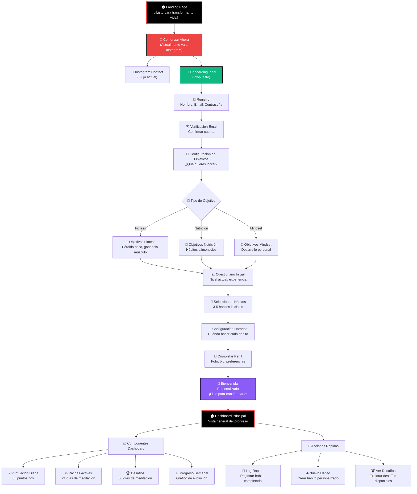

# 🎯 User Journey: Onboarding Perfecto - Gainz Factory

## 📊 Análisis del Estado Actual

### 🔍 Flujo Actual Identificado
1. **Landing Page** → Usuario ve "¿Listo para transformar tu vida?"
2. **Botón "Comenzar Ahora"** → Redirige a Instagram de Chepa
3. **Instagram** → Usuario debe contactar por WhatsApp
4. **WhatsApp** → Conversación manual para registro
5. **Registro Manual** → Chepa crea cuenta manualmente
6. **Dashboard** → Usuario accede directamente

### ❌ Problemas Identificados
- **Fricción Alta**: Requiere salir de la plataforma
- **Proceso Manual**: Dependiente de Chepa para registro
- **Sin Personalización**: No hay onboarding estructurado
- **Pérdida de Usuarios**: Muchos abandonan en Instagram
- **Escalabilidad Limitada**: No puede manejar muchos usuarios

---

## 🚀 User Journey Ideal Propuesto

### 📋 Flujo Completo de Onboarding



---

## 🎯 Detalle del Onboarding Perfecto

### 1. **Registro Inicial** (2 minutos)
```
📝 Formulario Simple:
- Nombre completo
- Email
- Contraseña (mínimo 6 caracteres)
- Confirmación de contraseña
```

### 2. **Verificación de Email** (30 segundos)
```
✉️ Email de Bienvenida:
- Link de verificación
- Mensaje motivacional de Chepa
- Próximos pasos del onboarding
```

### 3. **Configuración de Objetivos** (3-5 minutos)
```
🎯 Selección Múltiple:
□ Perder peso (X kg en Y meses)
□ Ganar masa muscular
□ Mejorar hábitos alimenticios
□ Desarrollar rutina matutina
□ Reducir estrés y ansiedad
□ Mejorar productividad
□ Dormir mejor
□ Dejar malos hábitos (específico)
```

### 4. **Cuestionario de Nivel** (2-3 minutos)
```
📊 Preguntas Clave:
- ¿Cuánto tiempo tienes disponible al día? (15min, 30min, 1h, 2h+)
- ¿Qué tan activo eres actualmente? (1-10)
- ¿Tienes experiencia con hábitos? (Principiante, Intermedio, Avanzado)
- ¿Prefieres rutinas estructuradas o flexibles?
- ¿Qué te motiva más? (Salud, apariencia, energía, rendimiento)
```

### 5. **Selección de Hábitos Iniciales** (2 minutos)
```
🎯 Recomendaciones Personalizadas:
- Basadas en objetivos seleccionados
- Máximo 5 hábitos iniciales
- Dificultad progresiva
- Con explicación de cada hábito
```

### 6. **Configuración de Horarios** (1-2 minutos)
```
📅 Planificación:
- Horarios preferidos para cada hábito
- Recordatorios personalizados
- Zona horaria automática
```

### 7. **Completar Perfil** (1-2 minutos)
```
👤 Información Adicional:
- Foto de perfil (opcional)
- Bio personal (opcional)
- Preferencias de notificaciones
- Aceptar términos y condiciones
```

### 8. **Bienvenida Personalizada** (30 segundos)
```
🎉 Pantalla de Éxito:
- Mensaje personalizado con nombre
- Resumen de objetivos y hábitos
- Botón "Comenzar mi Transformación"
- Video de bienvenida de Chepa (opcional)
```

---

## 🏠 Dashboard de Bienvenida

### 📊 Componentes Principales
1. **Puntuación Diaria**: Sistema de puntos motivacional
2. **Rachas Activas**: Hábitos en progreso con días consecutivos
3. **Desafíos**: Objetivos a corto y largo plazo
4. **Progreso Semanal**: Gráfico de evolución
5. **Acciones Rápidas**: Botones para acciones comunes

### 🚀 Acciones Inmediatas
- **Log Rápido**: Registrar hábito completado
- **Nuevo Hábito**: Crear hábito personalizado
- **Ver Desafíos**: Explorar desafíos disponibles
- **Estadísticas**: Ver progreso detallado

---

## 🎯 Beneficios del Nuevo Flujo

### ✅ Para el Usuario
- **Experiencia Fluida**: Todo en una plataforma
- **Personalización**: Onboarding adaptado a sus objetivos
- **Inmediatez**: Comienza a usar la app inmediatamente
- **Motivación**: Gamificación desde el primer día

### ✅ Para el Negocio
- **Escalabilidad**: Proceso automatizado
- **Retención**: Mejor onboarding = menos abandono
- **Datos**: Información estructurada de usuarios
- **Conversión**: Mayor probabilidad de conversión a premium

### ✅ Para Chepa
- **Menos Trabajo Manual**: Automatización del registro
- **Usuarios Mejor Preparados**: Ya saben qué quieren
- **Datos de Usuarios**: Información valiosa para coaching
- **Más Tiempo**: Enfocarse en coaching, no en registro

---

## 🛠️ Implementación Técnica

### 📱 Páginas Necesarias
1. `/onboarding/welcome` - Pantalla de bienvenida
2. `/onboarding/objectives` - Configuración de objetivos
3. `/onboarding/questionnaire` - Cuestionario de nivel
4. `/onboarding/habits` - Selección de hábitos
5. `/onboarding/schedule` - Configuración de horarios
6. `/onboarding/profile` - Completar perfil
7. `/onboarding/complete` - Bienvenida final

### 🔧 APIs Requeridas
- `POST /api/onboarding/objectives` - Guardar objetivos
- `POST /api/onboarding/questionnaire` - Guardar respuestas
- `POST /api/onboarding/habits` - Configurar hábitos iniciales
- `POST /api/onboarding/schedule` - Configurar horarios
- `GET /api/dashboard/welcome` - Datos del dashboard inicial

### 📊 Base de Datos
- Tabla `user_onboarding` para tracking del progreso
- Tabla `user_objectives` para objetivos seleccionados
- Tabla `user_questionnaire` para respuestas del cuestionario
- Actualizar tabla `habits` con hábitos iniciales del usuario

---

## 🎯 Métricas de Éxito

### 📈 KPIs del Onboarding
- **Tasa de Completación**: % usuarios que completan todo el onboarding
- **Tiempo de Onboarding**: Tiempo promedio para completar
- **Tasa de Abandono por Paso**: Dónde abandonan más usuarios
- **Retención Día 1**: % usuarios que regresan al día siguiente
- **Retención Día 7**: % usuarios activos después de una semana

### 🎯 Objetivos
- **Completación**: >80% usuarios completan onboarding
- **Tiempo**: <10 minutos total de onboarding
- **Retención Día 1**: >70% usuarios regresan
- **Retención Día 7**: >50% usuarios activos

---

## 🚀 Próximos Pasos

1. **Modificar botón "Comenzar Ahora"** para ir a `/onboarding/welcome`
2. **Implementar páginas de onboarding** paso a paso
3. **Crear APIs** para guardar datos del onboarding
4. **Actualizar dashboard** con datos del onboarding
5. **Implementar sistema de puntos** y gamificación
6. **A/B testing** del nuevo flujo vs Instagram

---

*Este user journey está diseñado para maximizar la conversión y retención de usuarios, creando una experiencia de onboarding fluida y motivacional que refleje los valores de Gainz Factory.*
